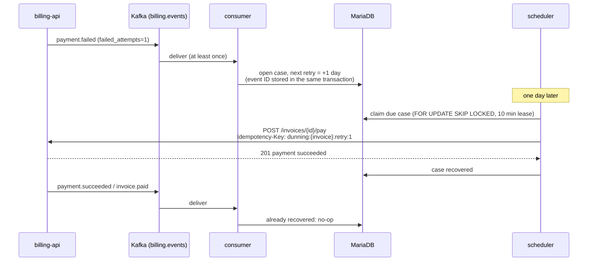

# dunning-service

[](https://github.com/alaa-almouradi1/dunning-service/actions/workflows/ci.yml)

Event-driven **payment recovery** ("dunning") for the
[subscription billing API](https://github.com/alaa-almouradi1/subscription-billing-api),
written in **Python 3.12** with FastAPI, aiokafka, SQLAlchemy 2 (async) and MariaDB.

When a subscription payment fails, this service retries it on a schedule
(1, 3, 5 and 7 days later by default), stops as soon as the invoice is paid,
voided or the subscription canceled, and when retries run out it writes off
the invoice and cancels the subscription through the billing API.

## How it works



| Component | Responsibility | Key ideas |
|---|---|---|
| `consumer.py` | Reads `billing.events` | Commit offsets (once per partition per poll) only after the DB commit; poison messages go to `billing.events.dlq`; transient errors rewind the partition and back off |
| `handlers.py` | Applies events to cases | Event IDs stored in the same transaction, so redelivery is a no-op; failure counts only move forward |
| `scheduler.py` | Executes due retries and write-offs | Claims with `SKIP LOCKED` and a lease; runs claimed work concurrently (bounded); calls the API with no transaction open; deterministic idempotency keys |
| `billing_client.py` | Talks to the billing API | Every answer maps to an explicit outcome; network errors mean "unknown", never "failed" |
| `policy.py` | When to retry, when to stop | Pure and unit-tested; schedule configurable as ISO 8601 durations |
| `app.py` | Process wiring and HTTP | Liveness/readiness probes, token-protected `/metrics` and `/cases`, graceful shutdown on SIGTERM |
| `retention.py` | Keeps tables bounded | Prunes processed event IDs older than the redelivery window, in small batches |

Why it is built this way: [docs/adr](docs/adr).

## Security

| Concern | How it is handled |
|---|---|
| Calls to the billing API | A dedicated key with only the scopes dunning needs (`billing.read`, `payments.write`, `invoices.write`, `subscriptions.write`) |
| Admin and metrics endpoints | `/cases` and `/metrics` require separate Bearer tokens (`DUNNING_ADMIN_TOKEN`, `DUNNING_METRICS_TOKEN`), compared in constant time. **Without a token configured the endpoint is disabled**, not open. Health probes stay public and expose no data |
| Secrets | Database URL, API key, tokens and Kafka password are `SecretStr`: never in logs or reprs. In Kubernetes they come from a Secret, never from values files |
| Kafka | TLS and SASL (PLAIN, SCRAM-SHA-256/512) for managed clusters; a SASL config without credentials fails at startup |
| Container | Non-root user, read-only root filesystem, all capabilities dropped |
| Supply chain | `pip-audit` on the pinned dependency set in CI; Dependabot for pip, Actions and Docker |

## Scaling and performance

| Concern | How it is handled |
|---|---|
| Independent scaling | The consumer and the scheduler run as separate Deployments: consumers up to the topic's partition count, schedulers freely (`SKIP LOCKED` claims) |
| Scheduler throughput | Claimed retries run concurrently (`DUNNING_SCHEDULER_CONCURRENCY`, default 10); HTTP connections are pooled and kept alive |
| Consumer throughput | One offset commit per partition per poll; a failing partition does not hold up the others |
| Database | Connection pool sized to the concurrency, recycled before MariaDB drops idle connections; indexes for the "what is due?" and retention queries |
| Bounded tables | Processed event IDs are pruned hourly once they are older than 30 days (longer than Kafka's retention) |
| Availability | Pod disruption budgets keep each component running during node drains; SIGTERM finishes the current batch |

## Running it

### With the billing API (full system)

```bash
# 1. in subscription-billing-api
docker compose up -d --build

# 2. here (joins the billing stack's network, retries every 1-3 minutes for the demo)
docker compose up --build
```

Then make a payment fail in the billing API (a customer with the
`tok_chargeDeclined` card), switch the customer to `tok_visa`, and watch:

```bash
curl -s -H "Authorization: Bearer local-admin-token" localhost:8000/cases | jq    # cases and next retries
docker compose logs -f dunning                                                    # structured JSON logs
curl -s -H "Authorization: Bearer local-metrics-token" localhost:8000/metrics | grep ^dunning_
```

### Locally, for development

```bash
python -m venv .venv && source .venv/bin/activate
pip install -e '.[dev]' -c constraints.txt
alembic upgrade head                        # SQLite by default (DUNNING_DATABASE_URL)
DUNNING_RUN_CONSUMER=false DUNNING_ADMIN_TOKEN=dev python -m dunning   # API + scheduler, no Kafka
```

All settings are environment variables prefixed with `DUNNING_` (see
`src/dunning/config.py`), for example `DUNNING_RETRY_SCHEDULE='["PT1M","PT2M"]'`.

## Tests

```bash
pytest                        # 85 tests (SQLite, fake Kafka, fake billing API)
ruff check . && ruff format --check . && mypy   # lint, format, strict typing
pip-audit -r constraints.txt --no-deps          # known vulnerabilities
KAFKA_BROKERS=localhost:29092 pytest -m kafka -o addopts=""   # against a real broker
```

CI runs all of the above, including the Kafka test against a real broker, and
also builds and smoke-tests the Docker image and lints the Helm chart.

Tests worth reading first:

- `test_scheduler.py`: a retry lost in a crash is replayed under the same
  idempotency key after its lease expires, so the card is charged once
- `test_consumer.py`: poison messages, database outages, partitions that must
  not block each other
- `test_handlers.py`: duplicate and out-of-order events

## Deployment

`helm/dunning-service` deploys the consumer and the scheduler as separate
Deployments with liveness/readiness probes, pod disruption budgets, a
pre-upgrade migration job, Prometheus scrape annotations, a non-root
read-only container, secrets from an existing Secret, and a termination grace
period that lets the current batch finish.

## What I would add next

- Real notifications (email/SMS) through an outbox of their own, so a
  customer is never emailed twice
- Smarter retry timing: retry around the customer's usual payday, and treat
  hard declines (stolen card) differently from soft ones (insufficient funds)
- A consumer-lag metric and alert, and load tests for the scheduler against a staging billing API
