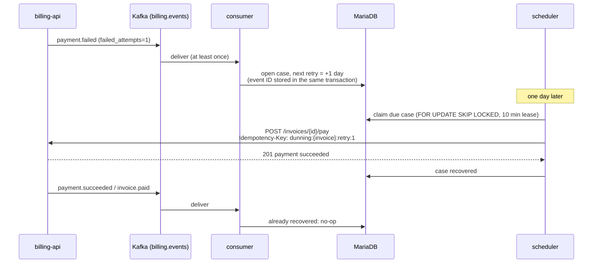

# dunning-service

[](https://github.com/alaa-almouradi1/dunning-service/actions/workflows/ci.yml)

Event-driven **payment recovery** ("dunning") for the
[subscription billing API](https://github.com/alaa-almouradi1/subscription-billing-api),
written in **Python 3.12** with FastAPI, aiokafka, SQLAlchemy 2 (async) and MariaDB.

When a subscription payment fails, this service retries it on a schedule
(1, 3, 5 and 7 days later by default), stops as soon as the invoice is paid,
voided or the subscription canceled, and when retries run out it writes off
the invoice and cancels the subscription through the billing API.

## How it works



| Component | Responsibility | Key ideas |
|---|---|---|
| `consumer.py` | Reads `billing.events` | Commit offsets only after the DB commit; poison messages go to `billing.events.dlq`; transient errors rewind the partition and back off |
| `handlers.py` | Applies events to cases | Event IDs stored in the same transaction, so redelivery is a no-op; failure counts only move forward |
| `scheduler.py` | Executes due retries and write-offs | Claims with `SKIP LOCKED` and a lease; calls the API with no transaction open; deterministic idempotency keys |
| `billing_client.py` | Talks to the billing API | Every answer maps to an explicit outcome; network errors mean "unknown", never "failed" |
| `policy.py` | When to retry, when to stop | Pure and unit-tested; schedule configurable as ISO 8601 durations |
| `app.py` | Process wiring and HTTP | Liveness/readiness probes, Prometheus `/metrics`, `/cases` for support staff, graceful shutdown on SIGTERM |

Why it is built this way: [docs/adr](docs/adr).

## Running it

### With the billing API (full system)

```bash
# 1. in subscription-billing-api
docker compose up -d --build

# 2. here (joins the billing stack's network, retries every 1-3 minutes for the demo)
docker compose up --build
```

Then make a payment fail in the billing API (a customer with the
`tok_chargeDeclined` card), switch the customer to `tok_visa`, and watch:

```bash
curl -s localhost:8000/cases | jq                      # the case and its next retry
docker compose logs -f dunning                         # structured JSON logs
curl -s localhost:8000/metrics | grep ^dunning_        # Prometheus metrics
```

### Locally, for development

```bash
python -m venv .venv && source .venv/bin/activate
pip install -e '.[dev]' -c constraints.txt
alembic upgrade head                        # SQLite by default (DUNNING_DATABASE_URL)
DUNNING_RUN_CONSUMER=false python -m dunning   # API + scheduler without Kafka
```

All settings are environment variables prefixed with `DUNNING_` (see
`src/dunning/config.py`), for example `DUNNING_RETRY_SCHEDULE='["PT1M","PT2M"]'`.

## Tests

```bash
pytest                        # 70 tests (SQLite, fake Kafka, fake billing API)
ruff check . && ruff format --check . && mypy   # lint, format, strict typing
KAFKA_BROKERS=localhost:29092 pytest -m kafka -o addopts=""   # against a real broker
```

CI runs all of the above, including the Kafka test against a real broker, and
also builds and smoke-tests the Docker image and lints the Helm chart.

Tests worth reading first:

- `test_scheduler.py`: a retry lost in a crash is replayed under the same
  idempotency key after its lease expires, so the card is charged once
- `test_consumer.py`: poison messages, database outages, partitions that must
  not block each other
- `test_handlers.py`: duplicate and out-of-order events

## Deployment

`helm/dunning-service` deploys to Kubernetes with liveness/readiness probes,
a pre-upgrade migration job, Prometheus scrape annotations, a non-root
read-only container, and a termination grace period that lets the current
batch finish.

## What I would add next

- Real notifications (email/SMS) through an outbox of their own, so a
  customer is never emailed twice
- Smarter retry timing: retry around the customer's usual payday, and treat
  hard declines (stolen card) differently from soft ones (insufficient funds)
- A consumer-lag metric and alert
